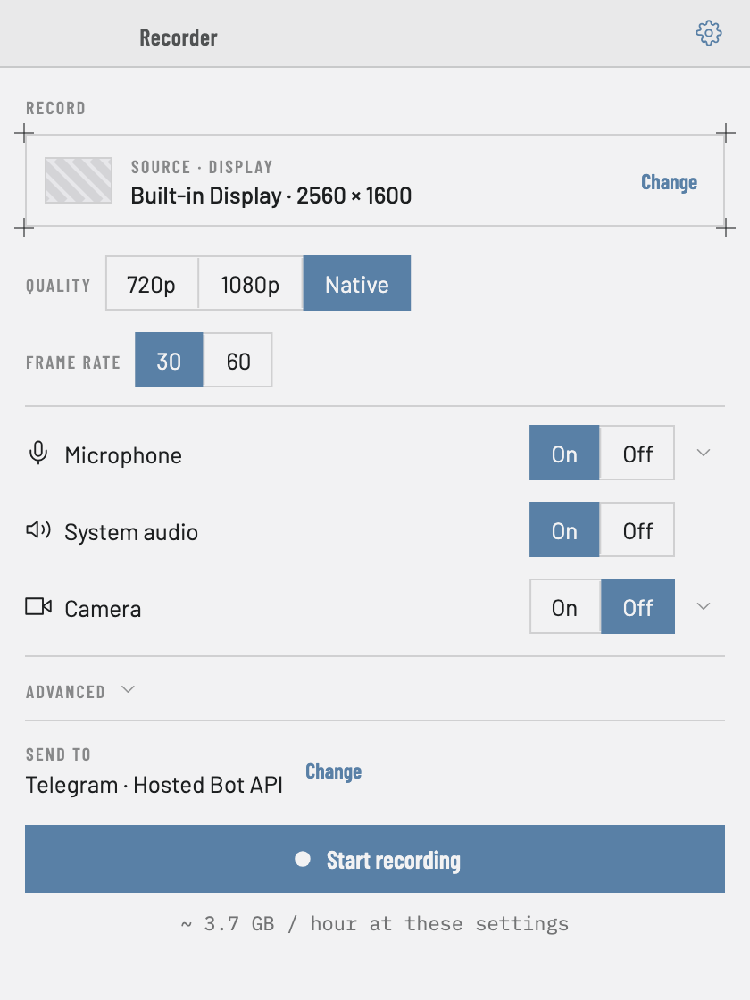
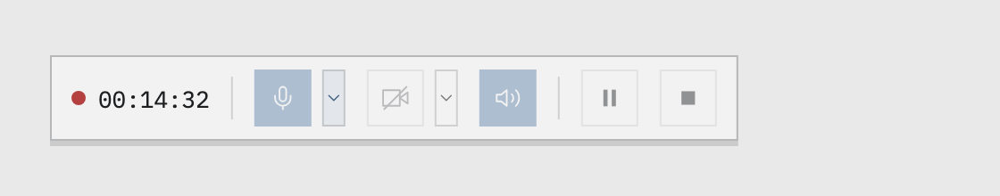
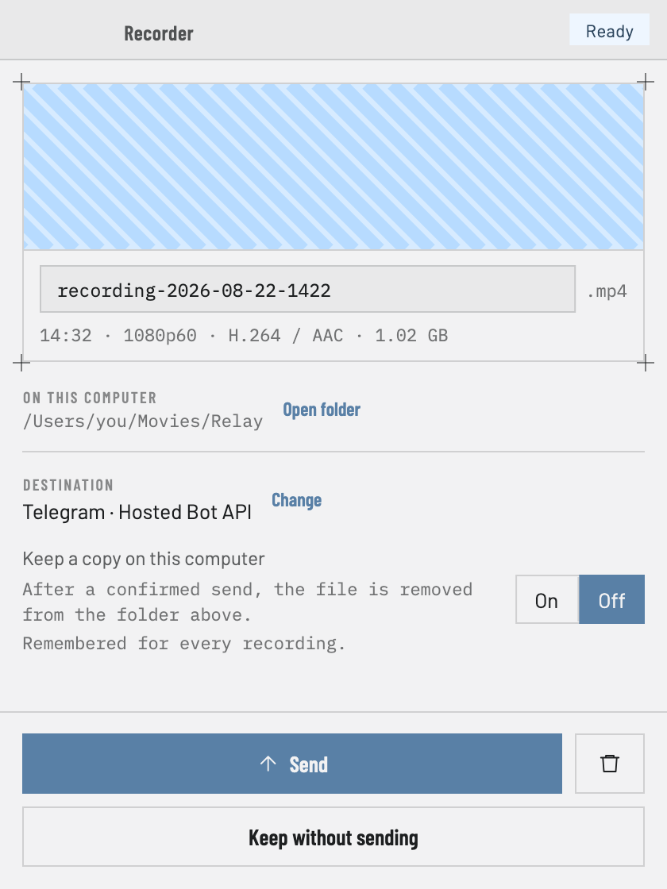

<h1 align="center">Relay</h1>

<p align="center">
  <strong>A desktop screen recorder that sends the recording somewhere useful.</strong><br>
  Records a screen or a window, then uploads it — to Telegram or WebDAV.
</p>

<p align="center">
  <a href="https://github.com/shishkinartem/Relay/actions/workflows/ci.yml">
    </a>
  
  
  
</p>

<p align="center">
  
</p>

<p align="center">
  
</p>

---

Most screen recorders stop at the file. Relay treats delivery as part of the job: when the
recording ends you either send it or delete it, and the local file is never removed until a
remote copy is confirmed.

- One entire screen or one application window, cursor included.
- Camera composited into the video as a picture-in-picture, at its own aspect ratio.
- Microphone and system audio mixed into one track.
- The control strip is excluded from the capture — it never appears in the output.
- Pause and resume; 720p or 1080p, 30 or 60 fps.
- Send to **Telegram** or **WebDAV** — neither needs a developer account, an API console,
  or a payment method.

<p align="center">
  
</p>

## Running it

Needs Flutter 3.47.1.

**macOS** — build, then launch the bundle:

```bash
flutter pub get
flutter build macos --release
open build/macos/Build/Products/Release/relay.app
```

`open` launches it as an application, exactly like double-clicking it in Finder. Do not
run the binary *inside* the bundle (`…/Contents/MacOS/relay`): macOS attributes
screen-recording permission to the responsible process, and a binary exec'd from a shell is
judged as that shell — Relay will see no screens.

Grant screen recording on first launch, then **relaunch** — macOS only applies it at the
next start.

**Windows** — on a Windows machine with MSVC and the Windows SDK:

```bash
flutter pub get
flutter build windows --release
```

This has never been compiled: there is no Windows host here. The code is written and
unit-tested in CI, but treat the first build as unproven.

## Documentation

| | |
|---|---|
| [Connecting Telegram or WebDAV](docs/upload-destinations.md) | step-by-step setup, and lifting Telegram's 50 MB limit |
| [Running locally](docs/development/running-locally.md) | Xcode, permissions, tests, packaging a build to send |
| [Engineering docs](docs/README.md) | architecture, testing, design system, decisions |
| [`TECHNICAL_SPEC.md`](TECHNICAL_SPEC.md) | product and technical behaviour — the source of truth |

## Status

macOS is built, run and tested. Windows is fully written but never compiled on a real
machine — see the [compatibility matrix](docs/development/compatibility-matrix.md) for
exactly what is and is not verified. Linux is deferred by design.

## Contributing

```bash
./tool/validate.sh
```

Behavioural changes need tests; anything expensive to reverse needs an
[ADR](docs/adr/README.md). House rules are in
[`docs/development/code-quality.md`](docs/development/code-quality.md).

## Licence

None yet — which means all rights reserved. Add one before expecting reuse.
